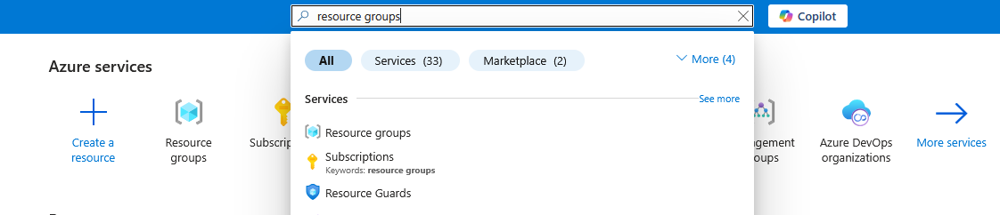
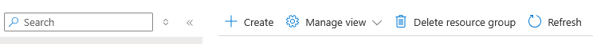
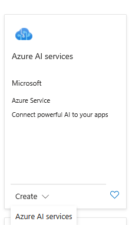
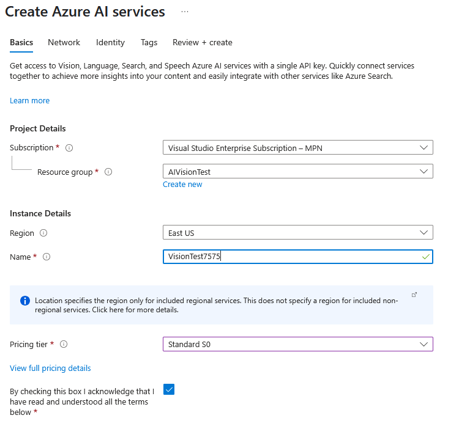
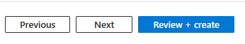
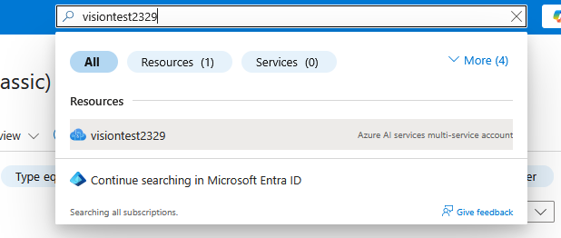
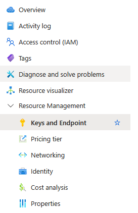

Welcome to Global Insights Corp., a leading firm specializing in transforming unstructured data into actionable intelligence. Our core mission involves digitizing vast archives of historical documents, processing real-time images from field agents (e.g., photos of receipts, street signs, product labels), and extracting critical information from various web sources. Our current manual transcription processes are slow, error-prone, and unsustainable.

To revolutionize our data ingestion pipeline, we are evaluating advanced Optical Character Recognition (OCR) solutions. Our goal is to find a robust, scalable, and highly accurate OCR service that can handle diverse image types, including scanned documents, photographs with varying lighting conditions, and text embedded in complex layouts.

In this lab, you will step into the shoes of a Global Insights Corp. AI Engineer. Your task is to set up and utilize Azure AI Services, specifically its powerful Azure AI Vision capabilities through the Azure AI Vision Studio, to perform OCR on different types of images without writing a single line of code for the primary tasks. An optional section will introduce how these capabilities can be accessed programmatically. By the end of this lab, you will have a foundational understanding of how to extract printed and handwritten text from images using the intuitive Vision Studio interface.
Lab Guide: Mastering OCR with Azure AI Vision Studio


## Instructions
Configuring Your Azure AI Vision Resource

1. Navigate to Resource Groups: In the Azure portal's main search bar at the top, type **Resource groups** and then select `Resource groups` from the search results to open the resource groups blade.
   
   

2. ```Locate Your Existing Resource Group: From the list of resource groups, identify and click on the specific resource group that has been pre-provisioned for you (e.g., global-insights-rg). This will open its overview page.```

3. Initiate New Resource Creation: Within your selected resource group's overview page, locate and click the `+ Create` button at the top to begin adding a new resource.
   
   

4. Search for Azure AI Services: In the "Search services and marketplace" bar on the "Create a resource" page, type "Azure AI services" and then select the corresponding option from the results. 
 
   


5. Start the Creation Process: On the **Create** drop down menu select `Azure AI services` to initiate the process.

    Configure Basic Details:

    * Confirm `Subscription`: Ensure your pre-provided Azure Subscription is selected (it should pre-populate).

    * Confirm `Resource Group`: Verify that your Resource group (e.g., global-insights-rg) is correctly pre-selected from the dropdown.

    * Select a `Region`: Choose an Azure Region (Define this on policy).

    * Provide a Unique `Name`: Enter a **unique Name** for your new Azure AI services resource (e.g., globalinsights-vision).

    * Choose a `Pricing Tier`: Select the **Standard S0** Pricing tier for this lab. This tier is suitable for common usage scenarios and demonstrations.
  
    * Carefully read and review the Responsible AI Notice and acknowledge your understanding by checking the provided checkbox.

     

6. Review and Create: Click the `Review + create` button.
   
     
        
 The deployment may take a few minutes to complete.    

      
Retrieving Your Access Credentials

7. Navigate to Your New Vision Resource: Once the deployment of your globalinsights-vision resource is complete, a notification will appear in the Azure portal. Click the Go to resource button from this notification, or search for your resource by name in the portal's search bar.

    

8. Access Keys and Endpoint: In the left-hand navigation menu of your newly created Vision resource, under the Resource Management section, click on Keys and Endpoint.
   
    

    To access your Azure AI Vision resource programmatically or through tools like Vision Studio, you will need its unique endpoint and an authentication key.

