Optical Character Recognition (OCR) is a technology that enables computers to "read" text from images. It converts different types of documents, such as scanned paper documents, PDFs, or images captured by a digital camera, into editable and searchable data. For Global Insights Corp., OCR is crucial for automating the extraction of information from a wide array of visual sources, eliminating manual data entry, and making vast amounts of data machine-readable. Azure AI Vision Studio is a web-based platform that provides a user-friendly interface to explore, build, and integrate AI vision capabilities without writing extensive code. It allows you to quickly test, demonstrate, and customize various features of Azure AI Vision, including OCR, image analysis, and facial recognition. For this lab, the Vision Studio will serve as your primary tool to interact with the Azure AI Vision service, enabling you to upload images and instantly see the extracted text and other insights.

## Instructions
Extracting Text with Azure AI Vision Studio and Optional API Interaction

1. Accessing Azure AI Vision Studio:  Launch Azure AI Vision Studio: Open your web browser and navigate to the Azure AI Vision Studio at https://portal.vision.cognitive.azure.com/

    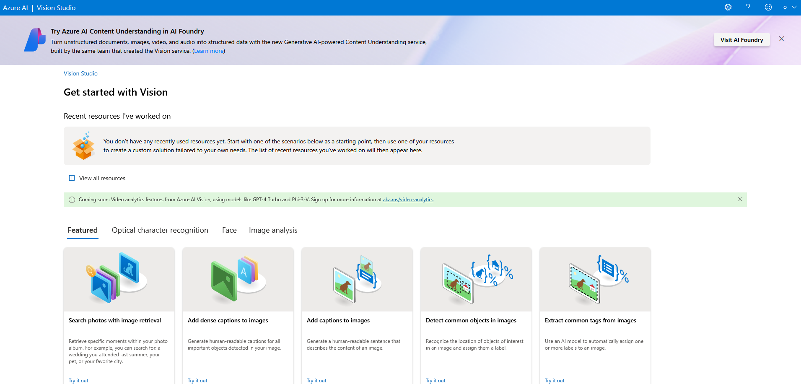

    You will use the Azure AI Vision Studio as your primary no-code platform for performing OCR.

2. Sign In: Sign in using the same Azure account credentials that you used to create your Azure resources.

     

    Select Azure Directory (if prompted): If this is your first time using the Vision Studio, you may be prompted to select your Azure directory. Choose the appropriate one that contains your resources.

3. Connect to Your Vision Resource: In the Vision Studio interface, ensure that your Subscription and the Azure AI services resource (globalinsights-vision) you created previously are correctly selected. You can usually change or confirm this via the settings icon (often a gear icon) in the top right corner or a resource selection dropdown.
   
   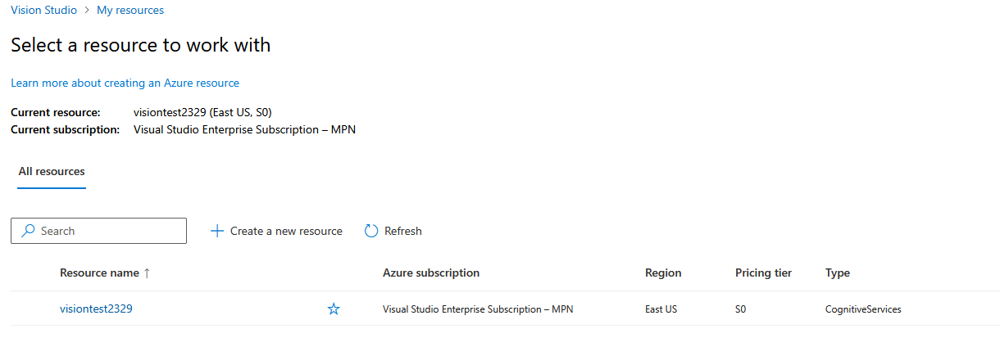

4. Navigate to the `Optical character recognition` tab: In the Azure AI Vision Studio, look at the left-hand navigation pane.  select `Optical character recognition`.
   
    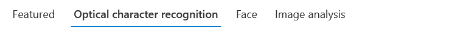

5. On the **Extract text from images page**, click on the `Try it out` button to open the analysis interface.

    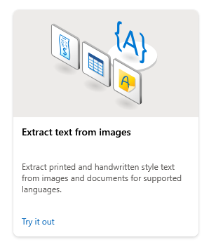

6. Confirm Resource Selection: Before proceeding, double-check that your correct Subscription and your globalinsights-vision resource are actively selected from the dropdowns at the top of the page. 
   
    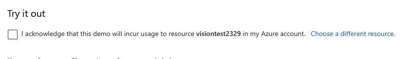

    Click on `Choose a different resource` to change the resource selection.

    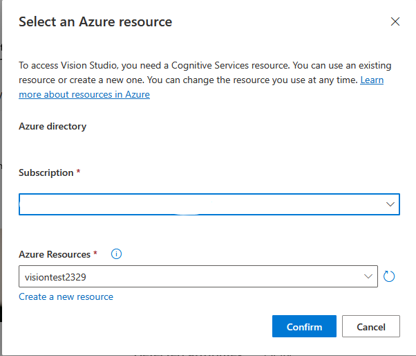

    once all ae verified check the box to proccd with image analysis.

    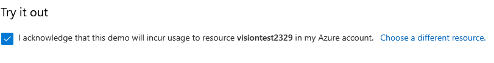

7.  Analyse sample image provided by Azure Vision Studio: Sample images are availble to test with Vision Studio. Select one of the sample image provided with the platform and observe the output.
   
    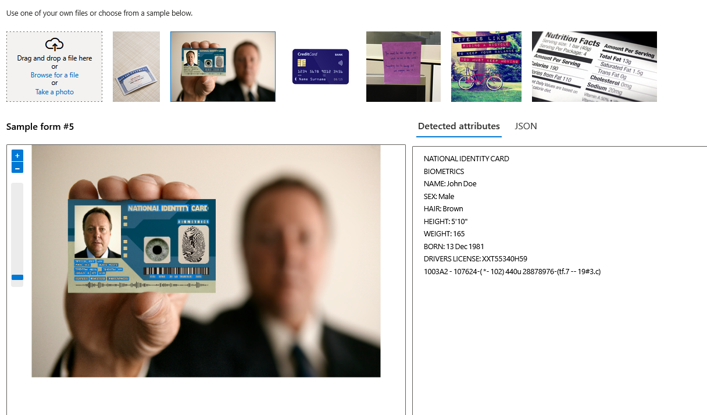

8. Upload a Local Image:  you will see an option labeled `Drag and drop an image or browse for a file or Take a photo` Click `Browse for a file` and select one of your local sample images (e.g., a scanned document or street_sign.jpg).
   
    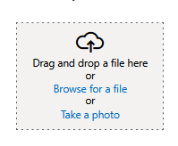

Review Analysis Results: Once the image is uploaded, the Vision Studio will automatically process and analyze it. Observe the results pane on the right side of the screen. The extracted text will be displayed, often with visual overlays showing individual lines or words and their bounding boxes directly on the image. You can also view the raw JSON response containing detailed information.

9. Programmatically access and Understanding API Interaction for Developers. Scroll down and select `Try out the SDK` option in the bottom left pane: 
    
   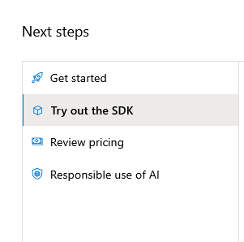

The Azure AI Vision Studio provides a user-friendly interface, but all its functionalities are powered by underlying REST APIs. This means the same OCR capabilities you just used can be accessed programmatically using HTTP requests or Azure SDKs in various programming languages (e.g., Python, C#, Java).

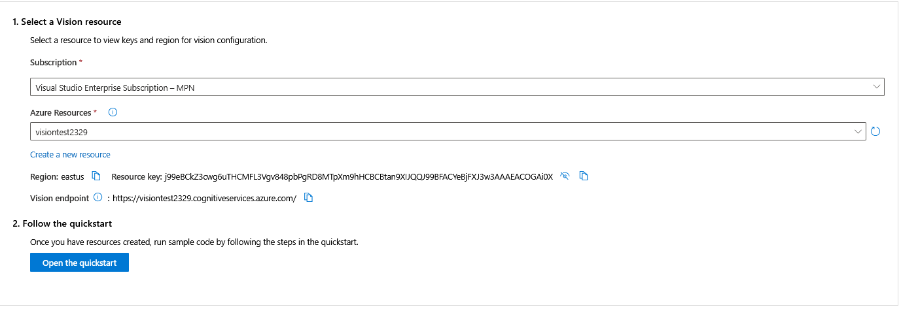

To integrate this into your own applications, you would typically refer to the official Azure AI Vision documentation. In the Vision Studio, for some features, you might even find "Code Samples" or "API reference" links that provide snippets or direct you to the relevant documentation page for the "Read" operation.

## Conclusion

Congratulations! You have successfully completed the Global Insights Corp. OCR lab using the Azure AI Vision Studio. You've efficiently configured an Azure AI services resource within your existing environment, connected it to the intuitive Vision Studio, and leveraged its capabilities to extract text from both local image files and public URLs without writing any code. You also gained an initial understanding of how these powerful features can be accessed via APIs for broader application integration.

This foundational understanding is critical for building intelligent applications that can understand and process visual information, just as Global Insights Corp. aims to do for its complex data digitization needs.

You've seen how Azure AI Vision, through the Vision Studio, can:

* Extract printed text from images efficiently.

* Extract handwritten text, understanding its capabilities and limitations.

* Seamlessly handle images from various sources (local files).

